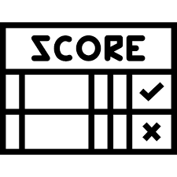

# Delivery 04 | ScoreKeeper

Made a scoreKeeper with vanilla JS

## Quality criteria

* 2 Separate counters (P1, P2)
* 3 Buttons (P1, P2, Reset)
* Each click increment each score
* When score max => Score in green & Lock everything
* Input to set the max score
* Vanilla JS (no framework) 

## Bonus criteria

* Better Style
* Darkmode

## Uses

* HTML5
* CSS3
* JAVASCRIPT

## Specials thanks to

* [javascript.info](javascript.info) (Documentation)
* [facebook.com/ScoreKeeperino/](https://www.facebook.com/ScoreKeeperino/) (ScoreKeeper logo)

